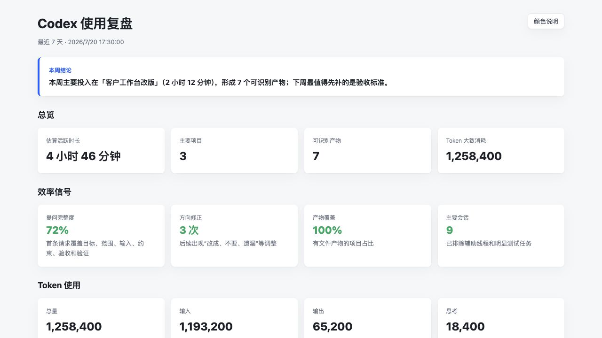

# Codex Review

[简体中文](README.md) | [English](README.en.md)

[](LICENSE)


> 📊 把散落在会话、项目和文件里的 Codex 使用记录，自动整理成一份能直接指导下一周行动的本地复盘报告。

Codex Review 是一个本地优先的 Codex skill。它会扫描最近的会话、项目产物、skills、自动化任务和 Token 记录，生成一份可折叠、可复制 Prompt、适合快速浏览的 HTML 报告。

你会直接看到：

- 时间和精力主要花在哪些项目上。
- 哪些首条 Prompt 缺少目标、范围、约束或验收标准。
- 哪些任务因为后补规则而发生方向修正。
- 哪些工作值得沉淀为模板、脚本、skill 或自动化。
- 下周最应该改变的 1-3 个 Codex 使用习惯。

正常使用不需要命令行。告诉 Codex “使用 `$codex-review` 复盘最近 7 天”，它会完成扫描、分析、生成报告和打开浏览器。



## ✨ 核心能力

| 能力 | 你能得到什么 |
| --- | --- |
| 使用总览 | 活跃时长、主要项目、产物数量和 Token 大致消耗 |
| 项目复盘 | 每个项目做了什么、花了多久、形成哪些关键文件 |
| Prompt 诊断 | 首条请求缺少什么、后续发生多少次方向或约束修正 |
| 协作优化 | 保持项、优先调整项和下周可立即执行的动作 |
| 复用建议 | 哪些重复工作适合模板化、脚本化、skill 化或自动化 |
| HTML 报告 | 本地生成、自动打开、支持折叠和一键复制 Prompt |
| 周度任务 | 可创建定期复盘，已有同类任务时不会重复添加 |

## 🚀 安装

克隆到 Codex skills 目录：

```bash
mkdir -p ~/.codex/skills
git clone https://github.com/joe-YYY/codex-review.git ~/.codex/skills/codex-review
```

也可以下载 ZIP，解压到：

```text
~/.codex/skills/codex-review/
```

重新打开 Codex 后，输入下面的提示词即可验证：

```text
使用 $codex-review 复盘我最近 7 天的 Codex 使用情况，并生成本地 HTML 报告。
```

## 🧭 使用方式

### 周度复盘

```text
使用 $codex-review 复盘我最近 7 天的 Codex 使用情况。
生成并打开本地 HTML 报告，重点看主要项目、投入时间、产出文件、Token 大致消耗、低效步骤、Prompt 问题和下周行动。
```

### 单项目复盘

```text
使用 $codex-review 复盘我最近在「项目名称」里的 Codex 使用情况。
重点分析目标是否清楚、任务拆解是否合理、哪里发生返工，以及下一次应该先补哪些约束。
```

### 创建每周任务

```text
使用 $codex-review 创建每周一 09:30 的 Codex 使用复盘任务。
已有同类任务时不要重复创建，报告生成后直接打开。
```

## 🧠 它如何判断

Codex Review 采用“通用复盘核心 + Codex 数据适配器”的结构：

1. 从本地 Codex 会话中读取时间、用户请求和 Token 事件。
2. 从工作区识别最近修改的代码、文档、表格、网页、图片等产物。
3. 结合自定义规则、工作目录、消息中的路径、产物目录和活动时间归并项目。
4. 检查首条请求是否覆盖交付物、输入、范围、约束、验收和验证。
5. 将结果写入统一 Schema，再生成 HTML 报告。

同一个产物只会归属一个项目。证据不足时使用中性任务类型，不编造项目名称。

## 🎯 自定义项目归并

在工作区根目录创建 `.codex-review.json`：

```json
{
  "projectRules": [
    {
      "name": "客户工作台",
      "category": "产品与设计",
      "patterns": ["customer-console", "客户工作台", "workspace/prd"]
    }
  ]
}
```

完整说明见 [项目归并规则](references/project-grouping.md)。

## 🔒 本地数据边界

- 扫描默认只读，不删除会话、缓存、项目文件或 skills。
- 报告和中间数据保存在本地。
- 扫描 JSON 默认不保存完整原始 Prompt、密钥和不必要的绝对路径。
- 明显的系统测试任务和辅助线程不计入主要活跃时长。
- 时间按会话内活跃片段估算，相邻活动间隔最多计 15 分钟。
- Token 来自本地 `token_count` 事件，可能与官方账单口径不同。

## 🛠️ 调试与验证

日常使用不需要执行下面的命令。开发、排错或贡献代码时可手动运行：

```bash
node scripts/scan_usage.mjs \
  --workspace "/path/to/workspace" \
  --output /tmp/codex_review_scan.json

node scripts/build_report.mjs \
  --input /tmp/codex_review_scan.json \
  --output /tmp/codex_review_report.html

node tests/run.mjs
```

脚本需要 Node.js 18 或更高版本，不依赖第三方 npm 包。

遇到路径、权限、空报告、Token 缺失或浏览器未打开等问题，查看 [常见问题](references/troubleshooting.md)。

## 📁 项目结构

```text
codex-review/
├── SKILL.md
├── agents/openai.yaml
├── assets/report_template.html
├── scripts/
│   ├── adapters/codex.mjs
│   ├── core/
│   ├── scan_usage.mjs
│   └── build_report.mjs
├── references/
│   ├── report-design.md
│   ├── project-grouping.md
│   └── troubleshooting.md
├── examples/
│   ├── sample_scan.json
│   ├── sample_report.html
│   └── sample_report.png
└── tests/run.mjs
```

## 🤝 参与贡献

问题反馈和 Pull Request 都可以直接提交。开始前请阅读 [CONTRIBUTING.md](CONTRIBUTING.md)。

## 📄 开源协议

本项目采用 [MIT License](LICENSE)。
